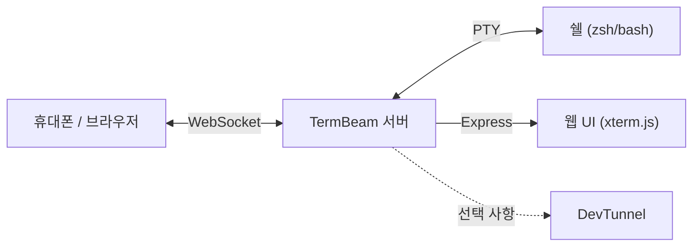

<div align="center">

# TermBeam Mobile

**터미널을 어떤 기기에서든 사용할 수 있게 해 줍니다. TermBeam에서 fork된 프로젝트입니다.**

[](https://www.npmjs.com/package/termbeam-mobile)
[](https://www.npmjs.com/package/termbeam-mobile)
[](https://github.com/kmss1258/TermBeam/actions/workflows/ci.yml)
[](https://nodejs.org/)
[](https://opensource.org/licenses/MIT)

</div>

TermBeam은 SSH나 포트포워딩 없이, 휴대폰/태블릿/브라우저에서 내 터미널에 접속할 수 있게 해 주는 도구입니다. 한 번 실행하고 QR 코드를 스캔하면 됩니다.

[Repository](https://github.com/kmss1258/TermBeam)

https://github.com/user-attachments/assets/9dd4f3d7-f017-4314-9b3a-f6a5688e3671

### 모바일 UI

<table align="center">
  <tr>
    <td align="center"></td>
    <td align="center"></td>
    <td align="center"></td>
    <td align="center"></td>
  </tr>
</table>

## 빠른 시작

```bash
npx termbeam-mobile
```

전역 설치도 가능합니다.

```bash
npm install -g termbeam-mobile
termbeam-mobile
```

터미널에 출력된 QR 코드를 스캔하거나, 표시된 URL을 다른 기기에서 열면 됩니다.

```bash
termbeam-mobile                        # 기본값: tunnel + 자동 비밀번호
termbeam-mobile --password mysecret    # 비밀번호 직접 지정
termbeam-mobile --no-tunnel            # LAN 전용
termbeam-mobile -i                     # 대화형 설정
```

자주 같은 주소로 쓰는 경우에는 `--persisted-tunnel`과 고정 비밀번호를 같이 쓰는 게 제일 덜 번거롭습니다. URL이 유지되고, 매번 접속 정보를 다시 공유할 필요가 없어집니다.

또한 이 프로젝트는 ngrok보다 DevTunnels가 더 잘 맞습니다. 보통 월 사용량이나 초당 요청량 같은 무료 티어 제한이 더 널널해서, 장시간 터미널 공유에 쓰기 편합니다.

## 주요 기능

### 모바일 중심

- **SSH 클라이언트가 필요 없음** — 브라우저만 열면 됩니다
- **터치 최적화 키바** — 화살표, Tab, Ctrl, Esc, 복사, 붙여넣기 등 지원
- **스와이프 스크롤**, 핀치 줌, 텍스트 선택 오버레이로 복사/붙여넣기 가능
- **iPhone PWA 안전 영역 지원**으로 앱처럼 자연스럽게 사용 가능

### 다중 세션

- **탭형 터미널** — 드래그로 순서 변경, 롱프레스/호버 미리보기 지원
- **분할 화면** — 두 세션을 좌우/상하로 자동 전환
- **세션 색상과 활동 표시** — 한눈에 상태 확인
- **폴더 브라우저** — 작업 디렉터리 선택, 세션별 초기 명령 지정 가능

### 생산성

- **터미널 검색** — 정규식, 매치 수, 이전/다음 이동 지원
- **명령 팔레트** — Ctrl+K / Cmd+K로 전체 기능 빠르게 실행
- **파일 업로드** — 휴대폰에서 세션 작업 디렉터리로 전송
- **파일 브라우저 & 다운로드** — 세션 디렉터리의 파일을 보고 기기로 다운로드
- **Markdown 뷰어** — `.md` 파일을 GitHub Flavored Markdown으로 미리보기
- **Git 변경 보기** — status/diff/blame/history를 코드 뷰어에서 확인
- **푸시 알림** — 백그라운드에서도 명령 완료 알림 수신
- **앱 내 업데이트** — npm/yarn/pnpm 전역 설치는 UI에서 자동 업데이트
- **완료 알림** — 백그라운드 명령 종료 시 브라우저 알림
- **30개 테마**와 조절 가능한 폰트 크기
- **포트 프리뷰** — 로컬 웹서버를 TermBeam으로 리버스 프록시
- **이미지 붙여넣기** — 클립보드에서 바로 삽입

### 기본 보안

- **자동 생성 비밀번호**와 rate limiting, httpOnly 쿠키
- **QR 코드 자동 로그인** — 단일 사용 토큰(5분 만료)
- **DevTunnels 연동** — 임시/고정 URL 모두 지원
- **보안 헤더** — X-Frame-Options, CSP, nosniff 등 모든 응답에 적용

## 동작 방식

TermBeam은 가벼운 웹 서버를 띄우고, 쉘을 가진 PTY(pseudo-terminal)를 생성한 뒤, 모바일에 최적화된 [xterm.js](https://xtermjs.org/) UI를 Express로 제공하고, 이 둘을 WebSocket으로 연결합니다. 여러 클라이언트가 같은 세션을 동시에 볼 수 있고, 모든 클라이언트가 끊겨도 세션은 유지됩니다.



## CLI 주요 옵션

| 옵션                  | 설명                                   | 기본값      |
| --------------------- | -------------------------------------- | ----------- |
| `--password <pw>`     | 접근 비밀번호 지정                     | 자동 생성   |
| `--no-password`       | 비밀번호 보호 끄기                     | —           |
| `--tunnel`            | 임시 devtunnel URL 생성                | 켜짐        |
| `--no-tunnel`         | 터널 끄기 (LAN 전용)                   | —           |
| `--persisted-tunnel`  | 재시작해도 유지되는 devtunnel URL      | 꺼짐        |
| `--port <port>`       | 서버 포트                              | `3456`      |
| `--host <addr>`       | 바인드 주소                            | `127.0.0.1` |
| `--lan`               | 모든 인터페이스 바인드 (LAN 접속)      | 꺼짐        |
| `--public`            | 공개 터널 허용 (Microsoft 로그인 없음) | 꺼짐        |
| `-i, --interactive`   | 대화형 설정 마법사                     | 꺼짐        |
| `--log-level <level>` | 로그 상세도                            | `info`      |

모든 옵션과 환경 변수는 [설정 문서](https://dorlugasigal.github.io/TermBeam/configuration/)를 참고하세요.

## 보안

TermBeam은 기본적으로 비밀번호를 자동 생성하고, `127.0.0.1`(localhost)로만 바인드하며, 안전한 터널을 생성합니다. 인증은 24시간 만료의 httpOnly 쿠키를 사용하고, 로그인은 분당 5회로 제한되며, QR 코드는 단일 사용 공유 토큰(5분 만료)을 포함합니다. 또한 모든 응답에 X-Frame-Options, CSP, nosniff 같은 보안 헤더가 설정됩니다.

반복적으로 같은 URL을 쓰는 로컬 워크플로우라면 `--persisted-tunnel`과 고정 비밀번호를 같이 쓰는 것이 가장 편합니다. 매번 URL이 바뀌지 않고, 접속 정보도 다시 공유할 필요가 없습니다.

## 기여

기여는 언제든 환영합니다 — [CONTRIBUTING.md](CONTRIBUTING.md)를 참고하세요.

## 변경 내역

[CHANGELOG.md](CHANGELOG.md)에서 버전 기록을 볼 수 있습니다.

## 라이선스

[MIT](LICENSE)

## 감사의 말

이 프로젝트의 아이디어를 떠올리게 해 준 [@tamirdresher](https://github.com/tamirdresher)님의 [블로그 글](https://www.tamirdresher.com/blog/2026/02/26/squad-remote-control)과, [cli-tunnel](https://github.com/tamirdresher/cli-tunnel) 구현에 감사드립니다.
