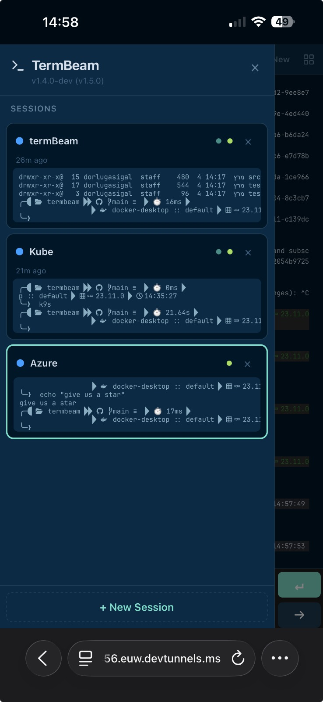
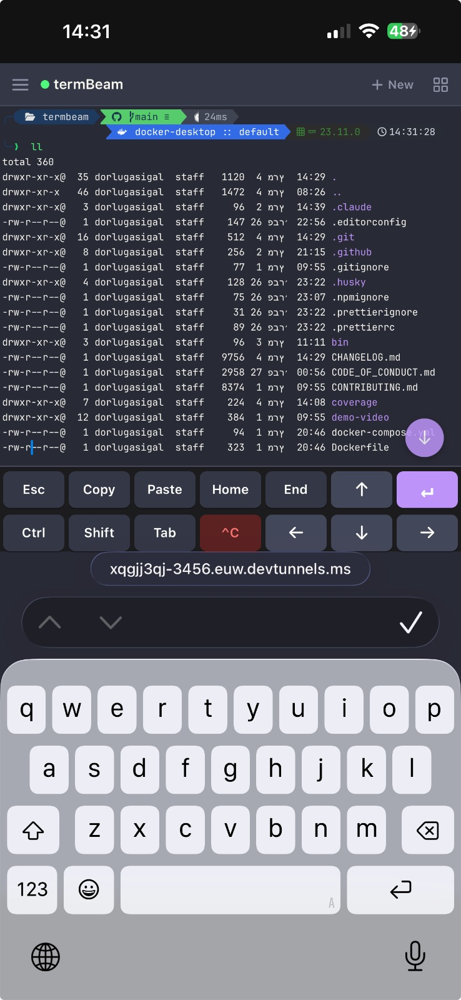
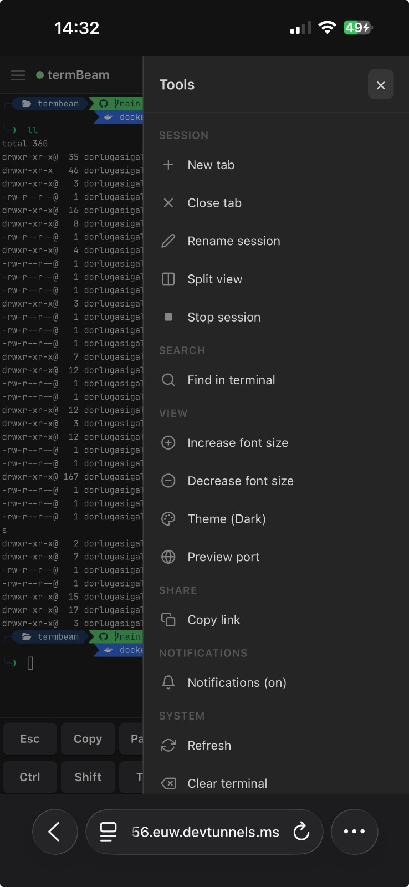
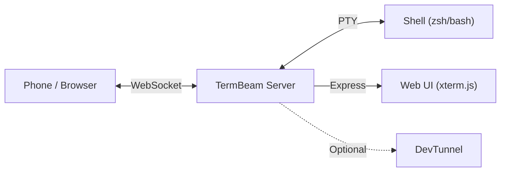

<div align="center">

# TermBeam

**Beam your terminal to any device.**

[](https://www.npmjs.com/package/termbeam)
[](https://www.npmjs.com/package/termbeam)
[](https://github.com/dorlugasigal/TermBeam/actions/workflows/ci.yml)
[](https://github.com/dorlugasigal/TermBeam/actions/workflows/ci.yml)
[](https://securityscorecards.dev/viewer/?uri=github.com/dorlugasigal/TermBeam)
[](https://nodejs.org/)
[](https://opensource.org/licenses/MIT)

</div>

TermBeam lets you access your terminal from a phone, tablet, or any browser — no SSH, no port forwarding, no configuration needed. Run one command and scan the QR code.

[Full documentation](https://dorlugasigal.github.io/TermBeam/) · [Website](https://termbeam.pages.dev)

https://github.com/user-attachments/assets/9dd4f3d7-f017-4314-9b3a-f6a5688e3671

### Mobile UI

<table align="center">
  <tr>
    <td align="center"></td>
    <td align="center"></td>
    <td align="center"></td>
  </tr>
</table>

## Quick Start

```bash
npx termbeam
```

Or install globally:

```bash
npm install -g termbeam
termbeam
```

Scan the QR code printed in your terminal, or open the URL on any device.

```bash
termbeam                        # tunnel + auto-password (default)
termbeam --password mysecret    # custom password
termbeam --no-tunnel            # LAN only
termbeam -i                     # interactive setup wizard
```

## Features

### Mobile-First

- **No SSH client needed** — just open a browser on any device
- **Touch-optimized key bar** with arrows, Tab, Ctrl, Esc, copy, paste, and more
- **Swipe scrolling**, pinch zoom, and text selection overlay for copy-paste
- **iPhone PWA safe-area support** for a native-app feel

### Multi-Session

- **Tabbed terminals** with drag-to-reorder and live tab previews on hover/long-press
- **Split view** — two sessions side-by-side (auto-rotates horizontal/vertical)
- **Session colors and activity indicators** for at-a-glance status
- **Folder browser** for picking working directory, optional initial command per session

### Productivity

- **Terminal search** with regex, match count, and prev/next navigation
- **Command palette** (Ctrl+K / Cmd+K) for quick access to all actions
- **File upload** — send files from your phone to the session's working directory
- **Completion notifications** — browser alerts when background commands finish
- **30 color themes** with adjustable font size
- **Port preview** — reverse-proxy a local web server through TermBeam
- **Image paste** from clipboard

### Secure by Default

- **Auto-generated password** with rate limiting and httpOnly cookies
- **QR code auto-login** with single-use share tokens (5-min expiry)
- **DevTunnel integration** for secure remote access — ephemeral or persisted URLs
- **Security headers** (X-Frame-Options, CSP, nosniff) on all responses; only detected shells allowed

## How It Works

TermBeam starts a lightweight web server that spawns a PTY (pseudo-terminal) with your shell, serves a mobile-optimized [xterm.js](https://xtermjs.org/) UI via Express, and bridges the two over WebSocket. Multiple clients can view the same session simultaneously, and sessions persist when all clients disconnect.



## CLI Highlights

| Flag                  | Description                                     | Default        |
| --------------------- | ----------------------------------------------- | -------------- |
| `--password <pw>`     | Set access password                             | Auto-generated |
| `--no-password`       | Disable password protection                     | —              |
| `--tunnel`            | Create an ephemeral devtunnel URL               | On             |
| `--no-tunnel`         | Disable tunnel (LAN-only)                       | —              |
| `--persisted-tunnel`  | Reusable devtunnel URL (stable across restarts) | Off            |
| `--port <port>`       | Server port                                     | `3456`         |
| `--host <addr>`       | Bind address                                    | `127.0.0.1`    |
| `--lan`               | Bind to all interfaces (LAN access)             | Off            |
| `--public`            | Allow public tunnel access (no Microsoft login) | Off            |
| `-i, --interactive`   | Interactive setup wizard                        | Off            |
| `--log-level <level>` | Log verbosity (error/warn/info/debug)           | `info`         |

For all flags, subcommands, and environment variables, see the [Configuration docs](https://dorlugasigal.github.io/TermBeam/configuration/).

## Security

TermBeam auto-generates a password and creates a secure tunnel by default, binding to `127.0.0.1` (localhost only). Auth uses httpOnly cookies with 24-hour expiry, login is rate-limited to 5 attempts per minute, QR codes contain single-use share tokens (5-min expiry), and security headers (X-Frame-Options, CSP, nosniff) are set on all responses.

For the full threat model and safety checklist, see [SECURITY.md](SECURITY.md). For detailed security documentation, see the [Security Guide](https://dorlugasigal.github.io/TermBeam/security/).

## Contributing

Contributions welcome — see [CONTRIBUTING.md](CONTRIBUTING.md).

## Changelog

See [CHANGELOG.md](CHANGELOG.md) for version history.

## License

[MIT](LICENSE)

## Acknowledgments

Special thanks to [@tamirdresher](https://github.com/tamirdresher) for the [blog post](https://www.tamirdresher.com/blog/2026/02/26/squad-remote-control) that inspired the solution idea for this project, and for his [cli-tunnel](https://github.com/tamirdresher/cli-tunnel) implementation.
