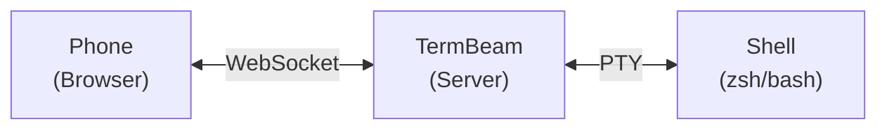

# TermBeam

**Beam your terminal to any device — no SSH, no config, one command.**

TermBeam is a mobile-optimized **web terminal** that lets you access your terminal from your phone, tablet, or any browser. It supports multiple sessions, touch-friendly controls, and works over a secure tunnel — all from a single `npx` command.

Built for developers who need quick remote terminal access without the hassle of SSH clients on mobile.

## Why TermBeam?

### Mobile-First

- **No SSH client needed** — just open a web browser on any device
- **Touch-optimized key bar** — arrows, Tab, Enter, Ctrl, Esc, and more
- **Copy & paste** — text overlay for finger selection + clipboard API with fallback
- **Swipe scrolling**, pinch zoom, and iPhone PWA safe-area support
- **Image paste** from clipboard, uploaded to server

### Multi-Session

- **Tabbed sessions** — switch, reorder, and manage multiple terminals
- **Split view** — two sessions side-by-side (horizontal desktop / vertical mobile)
- **Session colors & activity indicators** for at-a-glance status
- **Tab previews** on hover or long-press; **side panel** on mobile
- **Folder browser** and optional **initial command** per session

### Productivity

- **Terminal search** — <kbd>Ctrl+F</kbd> / <kbd>Cmd+F</kbd> with regex support
- **Command palette** — <kbd>Ctrl+K</kbd> / <kbd>Cmd+K</kbd> for quick access to all actions
- **File upload** — send files from your phone to the session's working directory via the command palette
- **Command completion notifications** — browser alerts when commands finish in background tabs
- **12 color themes** (dark, light, monokai, nord, dracula…) with adjustable font size
- **Port preview** — reverse-proxy a local web server through TermBeam
- **Share & refresh** actions for easy link sharing and PWA cache updates

### Secure by Default

- **One command to start** — `npx termbeam`
- **Password auth** with auto-generation, rate limiting, and httpOnly cookies
- **QR code auto-login** with single-use share tokens (5-min expiry)
- **Shell validation** — only detected shells are allowed
- **Interactive setup wizard** — run `termbeam -i` for guided configuration

## Quick Start

```bash
npx termbeam
```

Scan the QR code printed in your terminal, or open the URL on your phone. That's it.

## How It Works

TermBeam starts a lightweight web server that:

1. Spawns a PTY (pseudo-terminal) process with your shell
2. Serves a mobile-optimized web UI via Express
3. Bridges the browser and PTY via WebSocket
4. Renders the terminal using [xterm.js](https://xtermjs.org/)



## Learn More

- **[Getting Started](getting-started.md)** — install and run TermBeam in under a minute
- **[Usage Guide](usage-guide.md)** — tabs, split view, search, touch controls, and more
- **[Configuration](configuration.md)** — CLI flags, environment variables, and defaults
- **[Security](security.md)** — threat model, safe usage, and security features
- **[API Reference](api.md)** — REST and WebSocket API documentation
- **[Architecture](architecture.md)** — how TermBeam works under the hood
