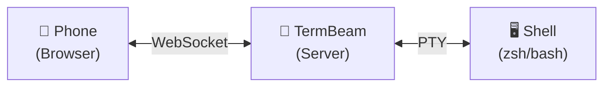

# 📡 TermBeam

**Beam your terminal to any device**

TermBeam lets you access your terminal from your phone, tablet, or any browser. It's mobile-optimized, supports multiple sessions, and comes with touch controls designed for small screens.

## Why TermBeam?

- 🚫 No SSH client needed — just a web browser
- 📱 Built for mobile — touch bar, swipe gestures, zoom, touch scrolling
- 🗂️ Tabbed sessions — switch, split, reorder, and preview multiple terminals
- 🎨 Session colors & activity indicators
- 📤 Share & refresh buttons for easy link sharing and PWA cache updates
- ⚡ One command to start — `npx termbeam`
- 🔐 Secure by default — localhost-only, password auth, rate limiting

## Quick Start

```bash
npx termbeam --generate-password
```

Scan the QR code printed in your terminal, or open the URL on your phone. That's it.

## How It Works

TermBeam starts a lightweight web server that:

1. Spawns a PTY (pseudo-terminal) process with your shell
2. Serves a mobile-optimized web UI via Express
3. Bridges the browser and PTY via WebSocket
4. Renders the terminal using [xterm.js](https://xtermjs.org/)


