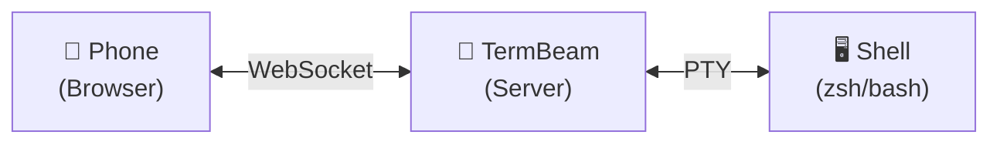

# TermBeam

**Beam your terminal to any device — no SSH, no config, one command.**

TermBeam is a mobile-optimized **web terminal** that lets you access your terminal from your phone, tablet, or any browser. It supports multiple sessions, touch-friendly controls, and works over a secure tunnel — all from a single `npx` command.

Built for developers who need quick remote terminal access without the hassle of SSH clients on mobile.

## Why TermBeam?

- **No SSH client needed** — just open a web browser on any device
- **Built for mobile** — touch bar, swipe gestures, zoom, touch scrolling
- **Tabbed sessions** — switch, split, reorder, and preview multiple terminals
- **Session colors & activity indicators** for at-a-glance status
- **Share & refresh buttons** for easy link sharing and PWA cache updates
- **One command to start** — `npx termbeam`
- **Secure by default** — password auth, rate limiting, tunnel encryption

## Quick Start

```bash
npx termbeam
```

Scan the QR code printed in your terminal, or open the URL on your phone. That's it.

## How It Works

TermBeam starts a lightweight web server that:

1. Spawns a PTY (pseudo-terminal) process with your shell
2. Serves a mobile-optimized web UI via Express
3. Bridges the browser and PTY via WebSocket
4. Renders the terminal using [xterm.js](https://xtermjs.org/)


